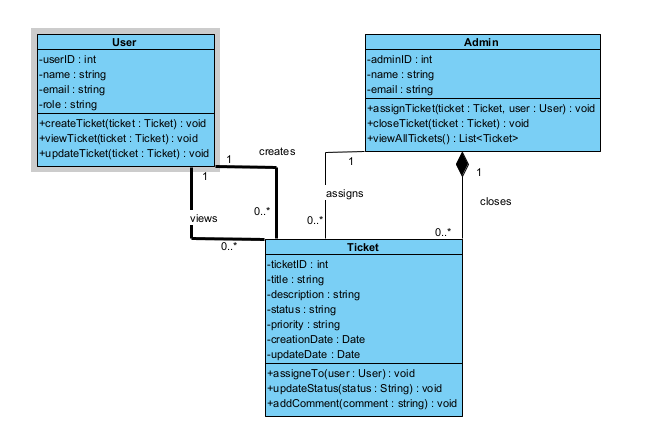
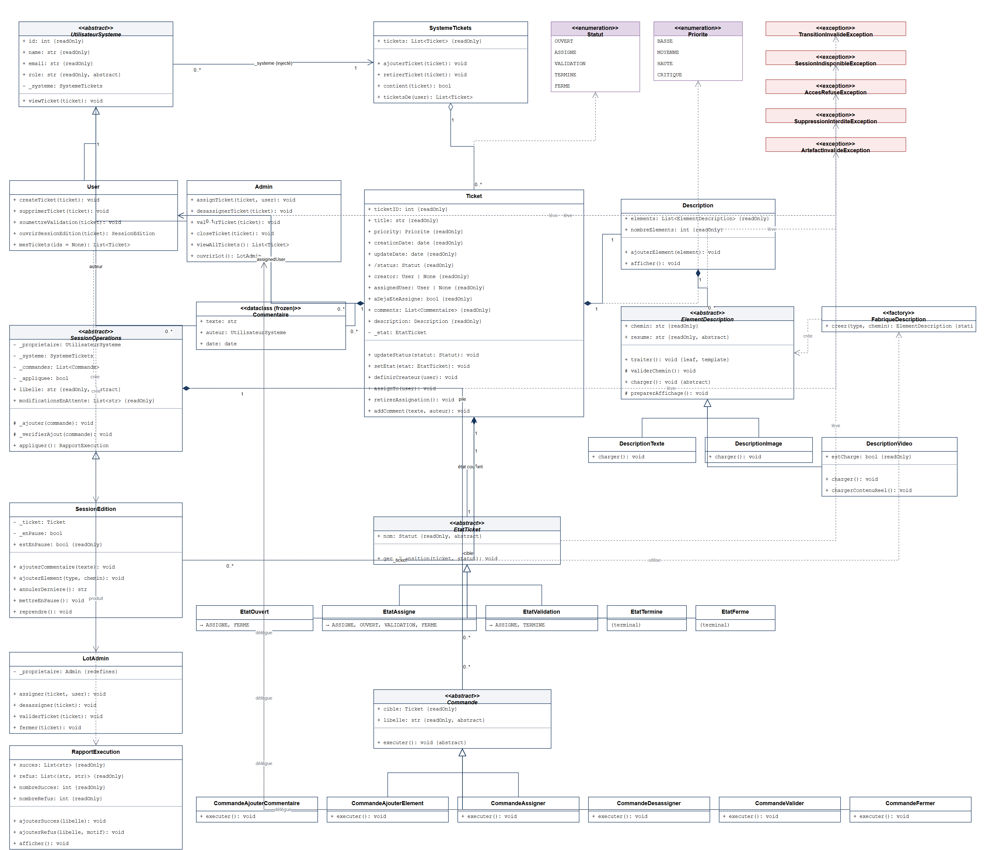
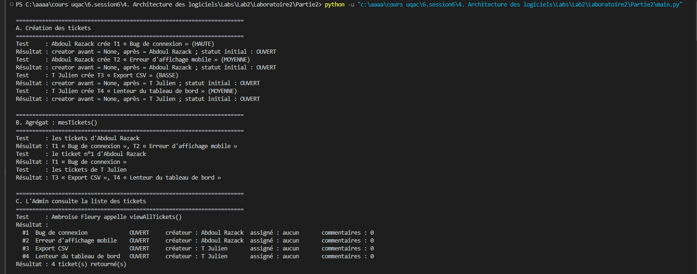
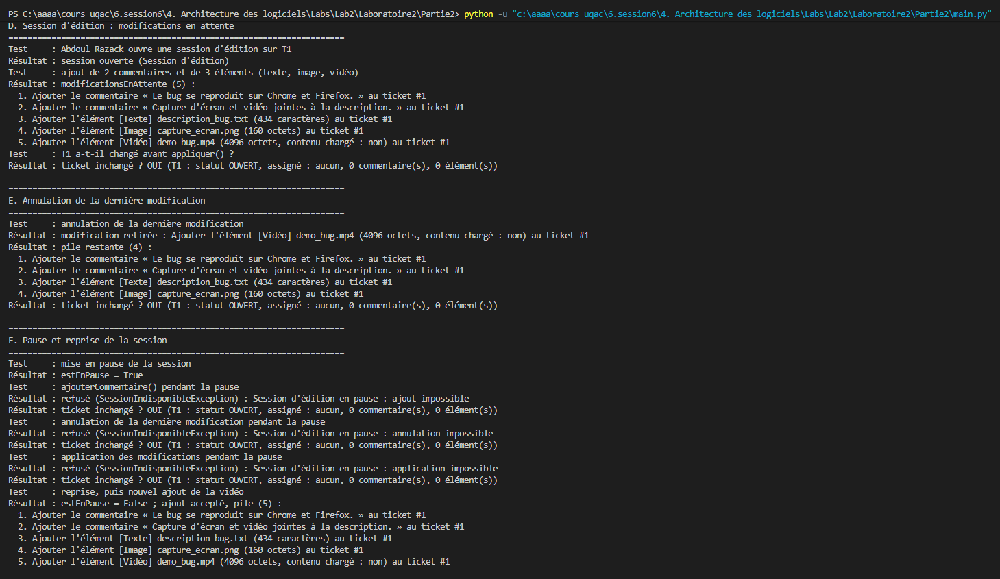
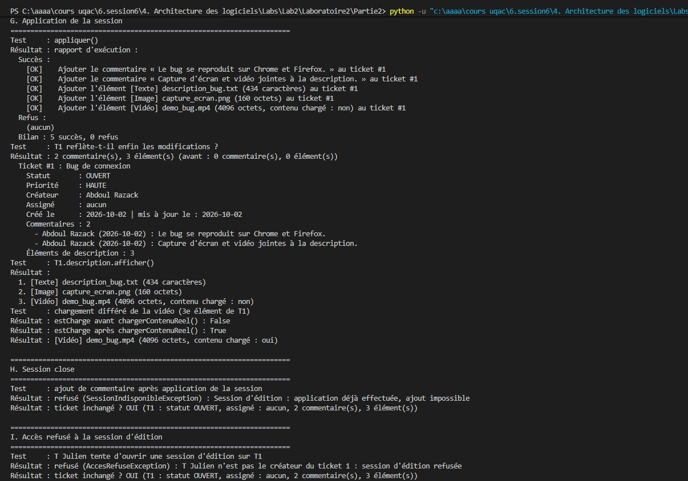
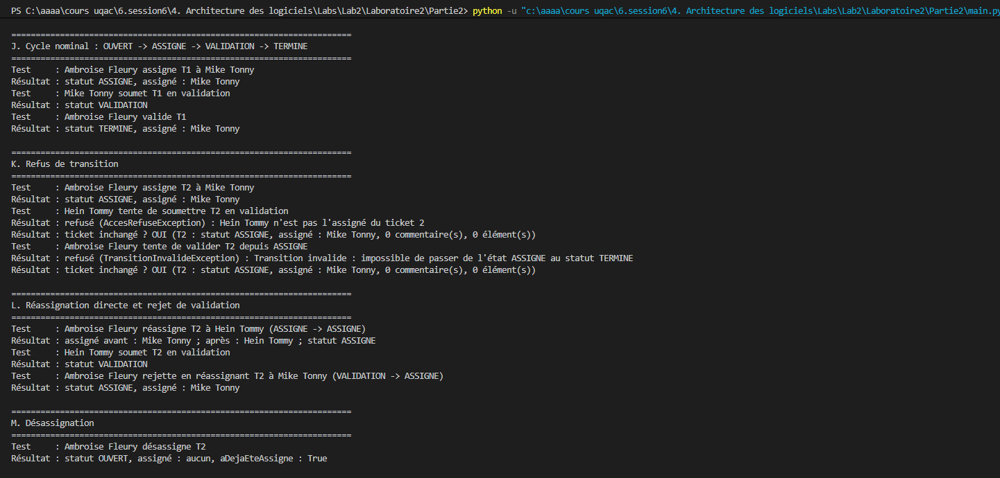
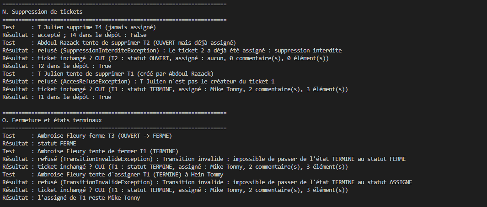
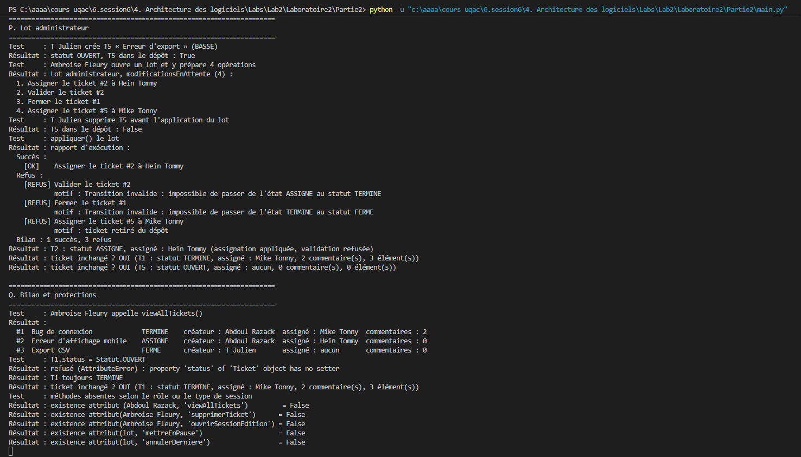

# Laboratoire 2 : système de gestion de tickets

Cours **6GEI311 Architecture des logiciels**

**Équipe :** Zongo T Julien, Zongo A Razack

Ce dépôt contient la **Partie 2** du laboratoire : un système de suivi de tickets en Python qui met en œuvre quatre patrons de conception, **State**, **Template Method**, **Factory Method** et **Command**.

La **Partie 1** (implémentation littérale du diagramme de classes initial) est dans un dépôt séparé : [Laboratoire2_6GEI311_Architecture_des_logiciels_Partie1](https://github.com/zongo-julien/zongo-julien-Laboratoire2_6GEI311_Architecture_des_logiciels_Partie1). Ce README présente les résultats des deux parties.

## Sommaire

1. [Installation](#installation)
2. [Utilisation](#utilisation)
3. [Résultats](#résultats)
   - [Partie 1 : diagramme initial](#partie-1--diagramme-initial)
   - [Partie 2 : diagramme amélioré](#partie-2--diagramme-amélioré)
   - [Fonctionnalités implémentées](#fonctionnalités-implémentées)
   - [Patrons de conception](#patrons-de-conception)
   - [Démonstration (captures d'écran)](#démonstration-captures-décran)
4. [Ce que nous avons appris](#ce-que-nous-avons-appris)
5. [Structure du code](#structure-du-code)

## Installation

**Prérequis :** Python 3.10 ou plus récent et Git. Aucune dépendance externe n'est nécessaire, le projet n'utilise que la bibliothèque standard.

Cloner le dépôt :

```bash
git clone https://github.com/zongo-julien/Laboratoire2_6GEI311_Architecture_des_logiciels_Partie2.git
```

Se placer à la racine du dépôt :

```bash
cd Laboratoire2_6GEI311_Architecture_des_logiciels_Partie2
```

## Utilisation

### Lancer la démonstration

```bash
python main.py
```

Le programme doit être lancé depuis la racine du dépôt, car les chemins des ressources (`ressources/...`) sont relatifs. Il exécute 17 scénarios, de A à Q, présentés dans la section [Démonstration](#démonstration-captures-décran). Chaque scénario affiche le test effectué (`Test :`) puis son résultat (`Résultat :`). Quand une opération doit être refusée, le programme capture l'exception, affiche son message et vérifie que le ticket est resté inchangé.

### Utiliser le système dans son propre code

Tous les acteurs partagent un même dépôt, `SystemeTickets`, injecté dans leur constructeur :

```python
from acteurs.admin import Admin
from acteurs.user import User
from modele.enums import Priorite
from modele.exceptions import TransitionInvalideException
from modele.systeme_tickets import SystemeTickets
from modele.ticket import Ticket

systeme = SystemeTickets()
admin = Admin(1, "Ambroise Fleury", "ambroise@uqac.ca", systeme)
abdoul = User(2, "Abdoul Razack", "abdoul@uqac.ca", systeme)
julien = User(3, "T Julien", "julien@uqac.ca", systeme)

# 1. Un utilisateur crée un ticket (statut initial : OUVERT)
ticket = Ticket(1, "Bug de connexion", Priorite.HAUTE)
abdoul.createTicket(ticket)

# 2. Son créateur le complète dans une session d'édition, puis applique
session = abdoul.ouvrirSessionEdition(ticket)
session.ajouterCommentaire("Le bug se reproduit sur Chrome.")
session.ajouterElement("texte", "ressources/description_bug.txt")
session.appliquer().afficher()

# 3. Cycle de vie : OUVERT -> ASSIGNE -> VALIDATION -> TERMINE
admin.assignTicket(ticket, julien)
julien.soumettreValidation(ticket)
admin.validerTicket(ticket)
abdoul.viewTicket(ticket)

# 4. Une transition interdite est refusée et le ticket reste intact
try:
    admin.closeTicket(ticket)
except TransitionInvalideException as erreur:
    print(erreur)
```

Sortie :

```text
  Succès :
    [OK]    Ajouter le commentaire « Le bug se reproduit sur Chrome. » au ticket #1
    [OK]    Ajouter l'élément [Texte] description_bug.txt (434 caractères) au ticket #1
  Refus :
    (aucun)
  Bilan : 2 succès, 0 refus
  Ticket #1 : Bug de connexion
    Statut       : TERMINE
    Priorité     : HAUTE
    Créateur     : Abdoul Razack
    Assigné      : T Julien
    Créé le      : 2026-10-02 | mis à jour le : 2026-10-02
    Commentaires : 1
      - Abdoul Razack (2026-10-02) : Le bug se reproduit sur Chrome.
    Éléments de description : 1
Transition invalide : impossible de passer de l'état TERMINE au statut FERME
```

### Opérations disponibles

| Objet | Méthode | Règle |
|---|---|---|
| `User` | `createTicket(ticket)` | L'utilisateur devient le créateur du ticket |
| `User` | `supprimerTicket(ticket)` | Seulement par le créateur, et si le ticket n'a jamais été assigné |
| `User` | `soumettreValidation(ticket)` | Seulement par l'assigné : `ASSIGNE` → `VALIDATION` |
| `User` | `ouvrirSessionEdition(ticket)` | Seulement par le créateur ; retourne une `SessionEdition` |
| `User` | `mesTickets(ids=None)` | Tickets créés par l'utilisateur, filtrables par identifiant |
| `Admin` | `assignTicket(ticket, user)` | Assignation, réassignation ou rejet d'une validation |
| `Admin` | `desassignerTicket(ticket)` | `ASSIGNE` → `OUVERT` |
| `Admin` | `validerTicket(ticket)` | `VALIDATION` → `TERMINE` |
| `Admin` | `closeTicket(ticket)` | `OUVERT` ou `ASSIGNE` → `FERME` |
| `Admin` | `viewAllTickets()` | Affiche et retourne tous les tickets du dépôt |
| `Admin` | `ouvrirLot()` | Retourne un `LotAdmin` |
| `User`, `Admin` | `viewTicket(ticket)` | Affiche le détail d'un ticket |
| `SessionEdition` | `ajouterCommentaire(texte)`, `ajouterElement(type, chemin)` | Ajoute une modification en attente ; `type` vaut `"texte"`, `"image"` ou `"video"` |
| `SessionEdition` | `annulerDerniere()`, `mettreEnPause()`, `reprendre()` | Gestion de la pile de modifications |
| `LotAdmin` | `assigner(ticket, user)`, `desassigner(ticket)`, `validerTicket(ticket)`, `fermer(ticket)` | Prépare une opération ; ni pause, ni reprise, ni annulation |
| `SessionEdition`, `LotAdmin` | `appliquer()` | Exécute les modifications en attente et retourne un `RapportExecution` |

L'Admin ne crée, ne supprime ni n'édite aucun ticket. Chacune de ses opérations demande **la transition d'abord, la donnée ensuite** : un refus ne modifie jamais le ticket.

## Résultats

### Partie 1 : diagramme initial

La Partie 1 traduit littéralement le diagramme de classes fourni : trois classes, `User`, `Admin` et `Ticket`. Le statut y est une simple chaîne de caractères, sans aucune règle de transition, et l'assigné et les commentaires ne sont pas mémorisés, faute d'attribut prévu dans le diagramme. Le code se trouve dans le [dépôt de la Partie 1](https://github.com/zongo-julien/Laboratoire2_6GEI311_Architecture_des_logiciels_Partie1).



### Partie 2 : diagramme amélioré

Le diagramme de la Partie 2 corrige les défauts de la Partie 1 et ajoute les sessions d'édition, les lots administrateur et les descriptions multimédias. Cliquer sur l'image pour l'agrandir. Le fichier source draw.io est disponible dans [`docs/diagramme_classes_partie2.drawio`](docs/diagramme_classes_partie2.drawio).



### Fonctionnalités implémentées

| Fonctionnalité | Acteur | Scénarios |
|---|---|---|
| Création de tickets | User | A |
| Suppression d'un ticket, seulement par son créateur et s'il n'a jamais été assigné | User | N |
| Consultation : `mesTickets()` avec ou sans filtre, `viewTicket()`, `viewAllTickets()` | User, Admin | B, C, G, Q |
| Session d'édition : modifications en attente, annulation, pause et reprise, application groupée avec rapport | User | D, E, F, G, H |
| Description multimédia (texte, image, vidéo) avec chargement différé de la vidéo | User | D, G |
| Cycle de vie contrôlé par une machine à états | Admin, User | J, K, O |
| Réassignation directe et rejet d'une validation | Admin | L |
| Désassignation | Admin | M |
| Fermeture et états terminaux | Admin | O |
| Lot administrateur appliqué « au mieux » | Admin | P |
| Contrôles d'accès (créateur, assigné, rôle) | User, Admin | I, K, N, Q |
| Statut en lecture seule | — | Q |

### Patrons de conception

#### State — `etats/`, `modele/ticket.py`

Le statut d'un ticket n'est pas stocké : la propriété `status` (en lecture seule) est dérivée de l'état courant. `Ticket.updateStatus()` délègue entièrement la décision à l'état, qui accepte la transition (en instanciant le nouvel état) ou lève `TransitionInvalideException`.

| État | Transitions autorisées |
|---|---|
| `OUVERT` | `ASSIGNE`, `FERME` |
| `ASSIGNE` | `ASSIGNE` (réassignation), `OUVERT` (désassignation), `VALIDATION`, `FERME` |
| `VALIDATION` | `ASSIGNE` (rejet), `TERMINE` |
| `TERMINE` | aucune (état terminal) |
| `FERME` | aucune (état terminal) |

#### Template Method — `description/element_description.py`

`ElementDescription.traiter()` (marquée `@typing.final`) fixe l'ordre des étapes : `validerChemin()` → `charger()` → `preparerAffichage()`. Seule `charger()` varie selon le type d'artefact (texte, image, vidéo). `DescriptionVideo` pratique le **chargement différé** : `charger()` ne lit que la taille du fichier, et le contenu n'est lu que par `chargerContenuReel()`.

#### Factory Method — `description/fabrique_description.py`

`FabriqueDescription.creer(type_artefact, chemin)` crée l'élément voulu (`"texte"`, `"image"`, `"video"`) sans le charger. C'est le seul endroit du programme qui connaît les sous-classes concrètes ; tout autre type lève `ArtefactInvalideException`.

#### Command — `commandes/`, `sessions/`

Les modifications sont empilées sous forme de commandes dans une session, puis appliquées d'un coup par `appliquer()`, qui retourne un `RapportExecution`. L'application se fait « au mieux » : une commande refusée ne bloque pas les suivantes, et une commande dont le ticket a été retiré du dépôt est refusée avec le motif « ticket retiré du dépôt ».

- `SessionEdition` (côté User) : commentaires et éléments de description ; annulation de la dernière modification, pause et reprise.
- `LotAdmin` (côté Admin) : assigner, désassigner, valider, fermer ; ni pause, ni reprise, ni annulation.

### Démonstration (captures d'écran)

Sortie de `python main.py`, scénario par scénario.

#### A à C : création, agrégat `mesTickets()` et consultation par l'Admin

Deux utilisateurs créent quatre tickets, qui démarrent tous à l'état `OUVERT`. `mesTickets()` ne retourne que les tickets de leur créateur, et l'Admin voit l'ensemble du dépôt.



#### D à F : session d'édition, annulation, pause et reprise

Les cinq modifications restent en attente : le ticket T1 ne change pas avant `appliquer()`. L'annulation retire la dernière modification, et pendant la pause tout ajout, annulation ou application est refusé.



#### G à I : application de la session, session close et accès refusé

`appliquer()` produit un rapport de 5 succès. La vidéo n'est chargée réellement qu'à l'appel de `chargerContenuReel()`. Une session déjà appliquée refuse tout nouvel ajout, et un utilisateur qui n'est pas le créateur ne peut pas ouvrir de session sur le ticket.



#### J à M : cycle nominal, refus de transition, réassignation et désassignation

Le cycle `OUVERT` → `ASSIGNE` → `VALIDATION` → `TERMINE` est accepté. Un non-assigné ne peut pas soumettre en validation, et l'Admin ne peut pas valider un ticket qui n'est pas en validation. La réassignation directe, le rejet d'une validation et la désassignation fonctionnent.



#### N et O : suppression, fermeture et états terminaux

Un ticket jamais assigné peut être supprimé par son créateur, mais pas un ticket déjà assigné ni le ticket d'un autre utilisateur. Une fois `TERMINE` ou `FERME`, un ticket n'accepte plus aucune transition.



#### P et Q : lot administrateur, bilan et protections

Le lot de quatre opérations donne 1 succès et 3 refus : transition invalide deux fois, et ticket retiré du dépôt avant l'application. Écrire directement `T1.status` est refusé, et les méthodes réservées à un autre rôle n'existent tout simplement pas sur l'objet.



## Ce que nous avons appris

**Voir le défaut avant de le corriger.** En Partie 1, rien n'empêche de passer d'`OUVERT` à `TERMINÉ`. En Partie 2, la même demande lève une exception, et `ticket.status = …` aussi. Avoir écrit la mauvaise version d'abord a rendu chaque critique de la conception initiale facile et vérifiable.

**Le principe ouvert/fermé a ses limites.** Ajouter un état oblige à modifier l'état qui doit y mener, et un nouveau type d'artefact coûte une ligne dans la fabrique. Les patrons ne suppriment pas la modification, ils la ramènent à un endroit qu'on sait retrouver.

**Relire l'énoncé contre le modèle.** Notre première version interdisait la réassignation, que le client a ensuite demandée. La corriger n'a touché que deux classes d'état. De même, Pylance a signalé qu'un `Admin` ne pouvait pas être l'auteur d'un commentaire typé `User` : l'erreur était dans le modèle, pas dans le code.

**L'essentiel.** Toujours revenir vers le client pour connaître ses besoins profonds, qu'il aura mal ou pas assez explicités, dans un cahier des charges par exemple.

## Structure du code

```
main.py                     scénarios de démonstration A à Q
modele/
  enums.py                  Statut, Priorite
  exceptions.py             les cinq exceptions métier
  commentaire.py            Commentaire (dataclass gelée)
  ticket.py                 Ticket, contexte de la machine à états
  systeme_tickets.py        SystemeTickets, dépôt des tickets
etats/                      EtatTicket et les cinq états concrets
description/                Description, ElementDescription, sous-classes, fabrique
acteurs/                    UtilisateurSysteme, User, Admin
commandes/                  Commande et les six commandes concrètes
sessions/                   SessionOperations, SessionEdition, LotAdmin, RapportExecution
ressources/                 artefacts de démonstration (texte, image PNG, vidéo factice)
docs/                       diagrammes UML et captures d'écran du README
```

### Conventions de code

- Tous les attributs d'instance sont privés (préfixe `_`) ; les lectures passent par des propriétés en lecture seule, et aucune méthode `getX()` n'existe.
- Seules quelques méthodes désignées affichent (`viewTicket`, `viewAllTickets`, `Description.afficher`, `RapportExecution.afficher`) ; le reste de l'affichage est fait dans `main.py`.
- Les imports servant uniquement aux annotations sont placés sous `if TYPE_CHECKING:`. Les états se référençant mutuellement, chaque état importe ses successeurs localement dans `gererTransition()`.
